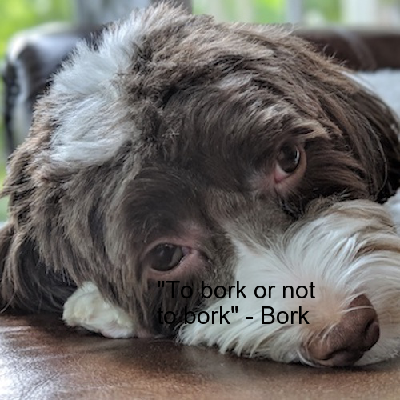

# Meme Generator



An app that generates memes. Memes can either be created randomly (by randomly picking an image and a quote from a predefined data pool) or by user input (quote & image url).

This app was built with the [Flask](https://flask.palletsprojects.com/en/2.0.x/)
web application framework.

## Dependencies/Installs

On your venv with a `Python 3.7.3` installation, navigate to the root directory and run `pip install -r requirements.txt`.

You also need to install `pdftotext` from here:

- Windows: https://www.xpdfreader.com/download.html
- macOS: `brew install --cask pdftotext`

## Execution

To start the app change to the `/src` and run `python3 app.py`. The frontend can be accessed at: http://127.0.0.1:5000/.

## Project Interface

The project consists of 2 modules:

- `QuoteEngine`
- `MemeGenerator`

### Quote Engine

This module contains all the classes responsible for parsing quotes from different types of data files(csv, docx, pdf & txt are the base ones included) and assigning them to a `QuoteModel`.

#### quote_model.py

Contains the class `QuoteModel` that represents a single quote.

#### ingestor_interface.py

Contains the (mostly) abstract class that the strategy objects (CSVIngestor, DocxIngestor etc) inherit from. These are the following:

### Strategy Objects/Classes

- `CSVIngestor` that can be found in `csv_ingestor.py`.
- `DocxIngestor` that can be found in `docx_ingestor.py`.
- `TextIngestor` that can be found in `text_ingestor.py`.
- `PdfIngestor` that can be found in `pdf_ingestor.py`.

#### ingestor.py

Contains the `Ingestor` class that encapsulates the strategy objects's functionality and is responsible for the selection of the appropriate class for parsing the data. It finally returns a list of `QuoteModel` objects.

A typical example using the parse method from `Ingestor` class:

```python
from QuoteEngine import Ingestor

quotes = Ingestor.parse("./_data/DogQuotes/DogQuotesDOCX.docx")

# returns a list of QuoteModel objects
for quote in quotes:
    print(quote)
```

### Meme Generator

This module contains the `MemeEngine` class that is responsible for generating a meme given an image and a quote (text/body and author).

The use of `MemeEngine` is as follows:

```python
from MemeGenerator import MemeGenerator

# intantiate a MemeGenerator with a given output directory
mg = MemeGenerator("memes/")

# generate meme from a given image and a quote
mg.make_meme(
    "src/_data/photos/dog/xander_2.jpg",
    text="My Quotes",
    author="The Author",
    width=400,
)
```

## Flask app

The Flask app consists of 2 components:

- main.py (The Udacity rubric calls for this to be named main.py)
- app.py

### main.py

This script encapsulates `MemeEngine`'s functionality by providing the main.py script. This script is executable at the command line and can be run by the following:

```console
usage: meme.py [-h] [--body BODY] [--author AUTHOR] [--path PATH]

Generate meme.

optional arguments:
  -h, --help       show this help message and exit
  --body BODY      Quote body.
  --author AUTHOR  Quote author.
  --path PATH      Image path.

```

### app.py

A typical Flask template script that provides the following endpoints for the user to interact with the frontent of the app (http://127.0.0.1:5000/):

- `/`: The homepage that includes the main html form for random meme generation (`./src/templates/meme.html`). It picks a random image and quote from `./src/_data/` and generates a meme with an instance of the `MemeEngine` object.
- `/create`: Provides the ability to generate a custom meme from a given image url and a quote. Consists of the following stages:
  - `GET`: The GET request gets the user data from the html form that user completes (`./src/templates/meme.html`), consisting of the following areas: `image url`, `Quote Body` & `Quote Author`.
  - `POST`: Once the form is filled the POST request is used to send the user data to the server in order to finally generate the meme.
